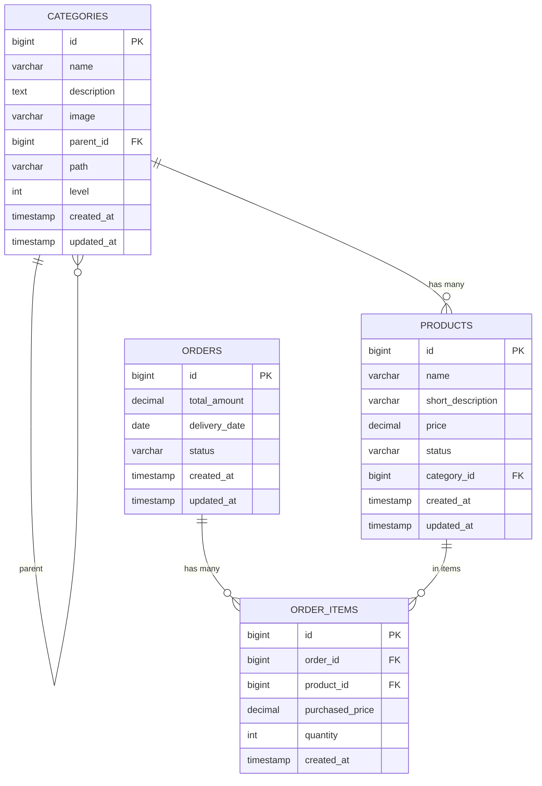

# Database Structure

This directory contains the database schema and test data for the Learn Modulith project.

## Structure

- `schema/` - Database schema definitions
  - `01_categories.sql` - Categories table with hierarchical structure
  - `02_products.sql` - Products table
  - `03_orders.sql` - Orders and Order Items tables
- `data/` - Test data scripts
  - `01_categories_data.sql` - Sample category data
  - `02_products_data.sql` - Sample product data
  - `03_orders_data.sql` - Sample order data

## Database Design

### ER Diagram (High Level)



### Categories (Hierarchical Structure)

The categories table uses a materialized path pattern combined with parent_id for efficient hierarchical queries:

- `id` - Primary key
- `name` - Category name
- `description` - Category description
- `parent_id` - Reference to parent category (nullable for root categories)
- `path` - Materialized path (e.g., '/1/5/12' for easy descendant queries)
- `level` - Depth level (0 for root categories)
- `created_at` - Creation timestamp
-- `updated_at` - Update timestamp

### Category Hierarchy Illustration

Example subset of the category tree from the test data:

```text
Electronics (id=1, path=/1, level=0)
├── Computers (id=5, path=/1/5, level=1)
│   ├── Laptops (id=13, path=/1/5/13, level=2)
│   │   ├── Business Laptops (id=26, path=/1/5/13/26, level=3)
│   │   ├── Gaming Laptops (id=27, path=/1/5/13/27, level=3)
│   │   └── Ultrabooks (id=28, path=/1/5/13/28, level=3)
│   ├── Desktops (id=14, path=/1/5/14, level=2)
│   └── Gaming PCs (id=15, path=/1/5/15, level=2)
├── Mobile Phones (id=6, path=/1/6, level=1)
│   ├── Smartphones (id=17, path=/1/6/17, level=2)
│   │   ├── Budget Smartphones (id=29, path=/1/6/17/29, level=3)
│   │   └── Flagship Smartphones (id=30, path=/1/6/17/30, level=3)
│   ├── Phone Cases (id=18, path=/1/6/18, level=2)
│   └── Chargers (id=19, path=/1/6/19, level=2)
└── Audio (id=7, path=/1/7, level=1)
    └── Cameras (id=8, path=/1/8, level=1)
```

**Querying subcategories:**
```sql
-- Get all subcategories (including nested) under a category
SELECT * FROM categories WHERE path LIKE '/1/%' OR id = 1;

-- Get direct children only
SELECT * FROM categories WHERE parent_id = 1;

-- Get all products under a category and its subcategories
SELECT p.* FROM products p
JOIN categories c ON p.category_id = c.id
WHERE c.path LIKE '/1/%' OR c.id = 1;
```

### Products

- `id` - Primary key
- `name` - Product name
- `short_description` - Short product description
- `price` - Product price (decimal)
- `status` - Product status (ACTIVE, INACTIVE, DISCONTINUED)
- `category_id` - Foreign key to categories table
- `created_at` - Creation timestamp
- `updated_at` - Update timestamp

### Orders

- `id` - Primary key
- `total_amount` - Total order amount (decimal)
- `delivery_date` - Expected delivery date
- `status` - Order status (PENDING, CONFIRMED, SHIPPED, DELIVERED, CANCELLED)
- `created_at` - Creation timestamp
- `updated_at` - Update timestamp

### Order Items

- `id` - Primary key
- `order_id` - Foreign key to orders table
- `product_id` - Foreign key to products table
- `purchased_price` - Price at time of purchase (decimal)
- `quantity` - Quantity ordered
- `created_at` - Creation timestamp

## Usage

### MySQL/MariaDB

1. Create the database:
```sql
CREATE DATABASE learn_modulith CHARACTER SET utf8mb4 COLLATE utf8mb4_unicode_ci;
USE learn_modulith;
```

2. Run schema scripts in order:
```bash
mysql -u username -p learn_modulith < schema/01_categories.sql
mysql -u username -p learn_modulith < schema/02_products.sql
mysql -u username -p learn_modulith < schema/03_orders.sql
```

3. Load test data:
```bash
mysql -u username -p learn_modulith < data/01_categories_data.sql
mysql -u username -p learn_modulith < data/02_products_data.sql
mysql -u username -p learn_modulith < data/03_orders_data.sql
```

### PostgreSQL

1. Create the database:
```sql
CREATE DATABASE learn_modulith;
\c learn_modulith;
```

2. Run schema scripts in order:
```bash
psql -U username -d learn_modulith -f schema/postgresql/01_categories.sql
psql -U username -d learn_modulith -f schema/postgresql/02_products.sql
psql -U username -d learn_modulith -f schema/postgresql/03_orders.sql
```

3. Load test data (same SQL files work for both MySQL and PostgreSQL):
```bash
psql -U username -d learn_modulith -f data/01_categories_data.sql
psql -U username -d learn_modulith -f data/02_products_data.sql
psql -U username -d learn_modulith -f data/03_orders_data.sql
```

**Note:** For PostgreSQL, you'll need to adjust the data files slightly:
- Change `AUTO_INCREMENT` to `SERIAL` or use `BIGSERIAL`
- Adjust date formats if needed
- The test data files use MySQL syntax but should work with minor adjustments

## Notes

- The materialized path pattern allows efficient queries of all descendants without recursive CTEs
- The path is maintained automatically through triggers or application logic
- Status fields use ENUM types for data integrity
- All timestamps are in UTC

